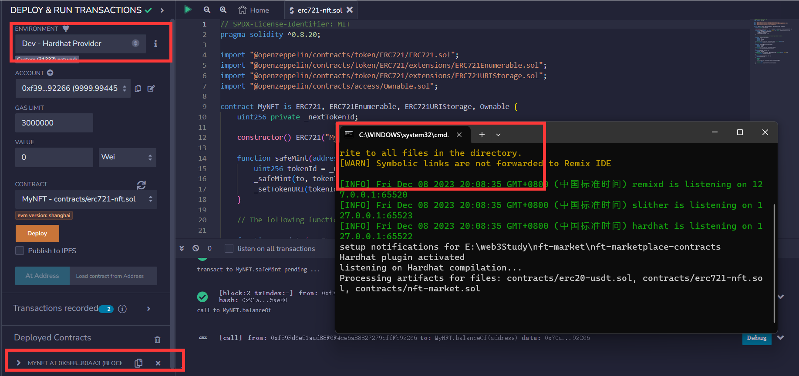
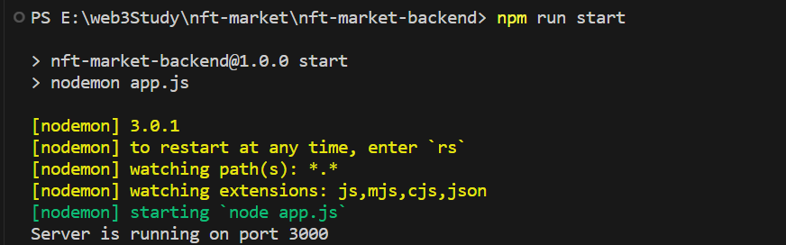
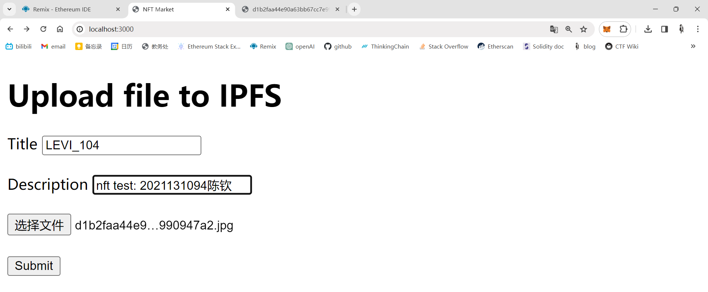
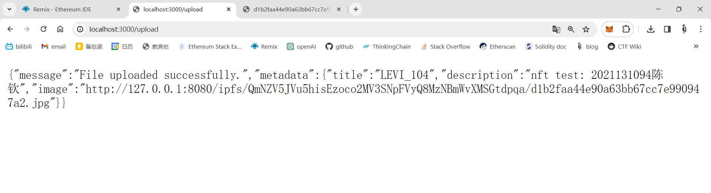
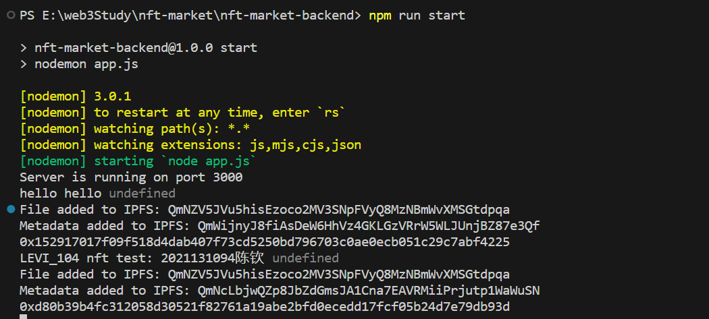

# Brief

This is a demo of nft market .

# Usage

## preparation

- clone the repo
- `npm i` 

## run

1.connect to `npx hardhat node`, `remixd`，and then deploy the NFT contract in remix

2.start the back-end

3.start ipfs

4.submit the info

5.return the json

6.visit the pic

7.the console ouput

